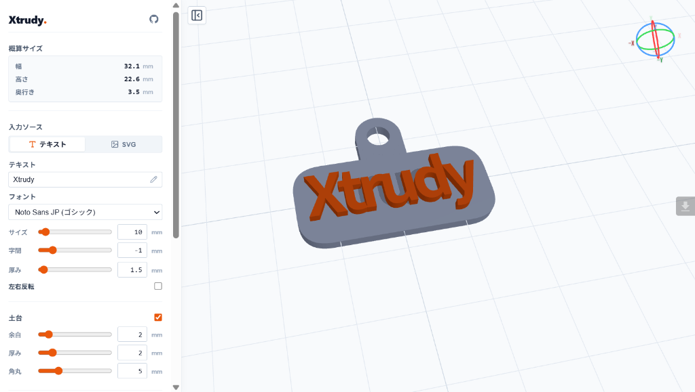

# Xtrudy

テキストや SVG 画像を 3D モデルに変換し、STL ファイルとして出力するブラウザベースのツールです。
キーホルダーやハンコなど、小物の 3D プリント用データ作成を主な用途としています。

Webサイト: https://v76nl.github.io/Xtrudy/



## 目次

1. [機能](#機能)
2. [使い方](#使い方)
3. [UI の説明](#ui-の説明)
4. [技術スタック](#技術スタック)
5. [設計メモ](#設計メモ)
6. [ファイル構成](#ファイル構成)

## 機能

- テキスト入力または SVG ファイルを読み込み、押し出し (Extrude) で 3D モデルを生成
- テキストの改行（複数行入力）および書字方向の切り替え（横書き / 縦書き）に対応
  - 縦書き時は文字の中心軸スナップによる軸ブレ防止・長音符などの記号自動回転・右から左への列送りを実装
- 土台プレートの自動生成 (余白 / 厚み / 角丸を調整可能)
- ストラップリングの追加 (真円 / 正方形 / 正三角形 / 正五角形)
  - 真円選択時は中空円柱形式。補強板の追加も可能
- 左右反転 (ハンコ用途向け)
- スライダーの直接数値入力およびマウスホイールによる微調整
- STL / ZIP エクスポート
  - 単一ファイル (一体型 STL)
  - 2色印刷用 (文字/SVG と 土台/リングを同一座標系で分けた ZIP 出力、Bambu Studio / PrusaSlicer 等向け)
  - 出力形式のブラウザ記憶 (localStorage) とワンクリック出力
- ナビゲーションギズモ (右上) で視点を切り替え可能

## 使い方

| コマンド | 実行内容 |
| --- | --- |
| `pnpm install` | 依存パッケージのインストール |
| `pnpm dev` | ローカル開発サーバーの起動 (タブタイトルに `[DEV] ` を付与) |
| `pnpm build` | 本番用ビルドの実行 (`dist/` に出力) |
| `pnpm preview` | ビルド成果物のローカルプレビュー |
| `pnpm check` | Biome によるコードチェック・自動修正 |
| `pnpm knip` | 未使用コード・依存関係の検出 |

起動後、コンソールに表示される URL (例: `http://localhost:5173/Xtrudy/`) にアクセスします。

## UI の説明

### 概算サイズ

生成されたモデル全体の外接ボックス (AABB) から計算した幅・高さ・奥行きを mm 単位で表示します。

### サイドパネル開閉

パネル右横のアイコンボタンをクリックすることで、サイドパネルの表示・非表示を切り替えられます。ヘッダーの GitHub アイコンからリポジトリへアクセスできます。

### 入力ソース

| 項目        | 説明                                                                                |
| ----------- | ----------------------------------------------------------------------------------- |
| テキスト    | フォント 9 種から選択して文字を入力します。改行（複数行入力）にも対応しています    |
| 書字方向    | 横書き（上から下へ行送り）または縦書き（右から左へ列送り）を選択します              |
| 行間 / 列間 | 複数行入力時のみ表示。行と行（縦書き時は列と列）の間隔 (mm)                         |
| SVG         | SVG ファイルを読み込んでパスを押し出します                                          |
| 厚み        | 押し出す深さ (mm)                                                                   |
| 左右反転    | X 軸で鏡像化します。ハンコのスタンプ面を作る際に使用します                          |

対応フォント:

- Noto Sans JP (ゴシック)
- Zen Maru Gothic (丸ゴシック)
- Dela Gothic One (超極太ゴシック)
- Noto Serif JP (明朝)
- Kaisei Tokumin (解星 特民)
- Yuji Boku (毛筆・油司 朴)
- Reggae One (レゲエ)
- DotGothic16 (ドット)
- Google Sans (英数字)

### 土台

メインモデルの背面に貼り付く平板です。

| 項目 | 説明                              |
| ---- | --------------------------------- |
| 余白 | メインモデルの外形からの余白 (mm) |
| 厚み | 土台の厚さ (mm)                   |
| 角丸 | 角の丸みの半径 (mm)               |

### ストラップリング

ストラップを通すためのリング状パーツを生成します。

| 項目            | 説明                                                             |
| --------------- | ---------------------------------------------------------------- |
| 形状            | 真円 / 正方形 / 正三角形 / 正五角形                              |
| 補強板          | 真円選択時のみ有効。リング下部とベース板を接続する板を生成します |
| 上端に自動配置  | ON にすると土台の上端にリングが自動で配置されます                |
| X 座標 / Y 座標 | リング中心の位置 (mm)                                            |
| サイズ          | リングの内径の半径 (mm)                                          |
| 太さ            | リングの線の太さ (mm)                                            |
| 回転            | リングの回転角度 (deg)                                           |

### ナビゲーションギズモ

右上に表示されている 3 色のリングで構成されたウィジェットです。

- 赤 (X) / 緑 (Y) / 青 (Z) の軸を示します
- +X / +Y / +Z / -X / -Y / -Z のラベルをクリックすると、その軸方向からの視点にスムーズに移動します
- カメラは OrbitControls でドラッグ / ピンチ / スクロールで操作できます

### STL / ZIP 出力

- **単一ファイル (一体型 STL)**: 全パーツを 1 つのメッシュに結合して出力します。通常の単色 3D プリント用です。
- **2色印刷用 (パーツ別 ZIP)**: 同一座標系を保持したまま「文字/SVG (`part_main.stl`)」と「土台+リング (`part_base.stl`)」を別々の STL に分離し、ZIP ファイルとして出力します。Bambu Studio や PrusaSlicer などのマルチカラー 3D プリンターで一括インポートして利用できます。
- 出力形式はブラウザに記憶され、次回からスムーズに出力できます。エクスポートボタン横の歯車アイコンからいつでも変更可能です。

## 技術スタック

| ライブラリ / ツール | バージョン | 用途                                                |
| ------------------- | ---------- | --------------------------------------------------- |
| Three.js            | 0.185      | 3D レンダリング / ジオメトリ生成 / STL エクスポート |
| clipper2-js         | 1.2.4      | フォントパスの Boolean Union (非多様体対策)         |
| opentype.js         | 1.3.4      | フォントファイルの解析とパス取得 (CDN)              |
| jszip               | 3.10.x     | 2色印刷用マルチパーツ STL の ZIP アーカイブ生成     |
| lucide              | 1.x        | UI アイコン (サイドパネル開閉など)                  |
| Vite                | 8.x        | 開発サーバー / ビルドツール                         |
| Biome               | 1.9.4      | 高速なコードチェック・フォーマッター                |
| knip                | 5.x        | 未使用コード・依存関係の検出                        |

バックエンドなし。

## 設計メモ

### 縦書き組版と軸ブレ防止

単に文字を縦に改行して並べると、フォントの advanceWidth や左右ベアリング (LSB) の差異により細い文字や記号が左右にブレてしまいます。
Xtrudy では各文字のバウンディングボックスの幾何学的水平中心を測定し、列の中心軸にスナップさせて配置することで綺麗な直線配置を実現しています。
また、長音符「ー」や各種約物（ダッシュ、括弧等）はグリフ中心をピボットとして時計回りに 90 度回転させて縦書き表示します。複数行は日本語組版の原則に従い、右から左へと列送りされます。

### フォントの非多様体対策

opentype.js が生成するパスは文字によって自己交差が発生することがあります (例: 'X')。
自己交差したまま `ExtrudeGeometry` に渡すとスライサーが非多様体エラーを起こすため、
clipper2-js で Boolean Union を行い、2D 段階で交差を解消してから押し出しています。

### テキストモードの土台生成 (Embed アプローチ)

テキスト柱の底面を土台に 0.1mm 埋め込むことで coincident face を回避しています。
スライサーの "Merge Internal Overlapping Parts" 機能が体積の重複部分を Union します。

- テキスト柱: z = 0.001 〜 +modelThickness
- 土台プレート: z = -baseThickness 〜 0

### ストラップリング補強板の形状

真円リング (中空円柱) とベース板の間に生成する補強板は、リング外周の下弧と
ベース板の上辺を結んだ 2D プロファイルを押し出して作成します。

- ケース A: ベース上辺が外周円と交差する場合 → 弓形断面
- ケース B: ベース上辺が円の下にある場合 → U 字状断面

### スライダーパラメータの一元管理 (Single Source of Truth)

各スライダーの最小値・最大値・ステップ・初期値・単位は、[src/state.ts](src/state.ts) の `SLIDER_CONFIGS` オブジェクトで一元管理されています。
HTML 側には `min` や `max` などの属性を重複記述せず、初期化時に TypeScript から DOM へ自動注入・バインドされるため、DRY かつ安全にパラメータ範囲を変更できます。

## ファイル構成

```text
xtrudy/
  ├── index.html
  ├── style.css
  ├── tsconfig.json
  ├── vite.config.ts
  ├── biome.json          - Biome リンター・フォーマッター設定
  ├── knip.json           - 未使用コード検出設定
  ├── screenshot.png      - アプリケーションのプレビュー画像
  ├── TECHNICAL_NOTES.md  - 3D 印刷適性・座標系・Clipper2 演算の技術ノート
  └── src/
      ├── main.ts         - エントリーポイント (ローカル開発時タイトル設定など)
      ├── state.ts        - アプリケーション状態 (StateType インターフェースと初期値)
      ├── scene.ts        - Three.js シーン / カメラ / ライト / ギズモの初期化
      ├── geometry.ts     - 3D 押し出しとジオメトリ生成のオーケストレーション
      ├── fonts.ts        - フォント定義と非同期読み込み
      ├── parts.ts        - 土台プレート / ストラップリング / 補強板の生成
      ├── export.ts       - STL エクスポート (メッシュ統合と重複頂点溶接)
      ├── ui.ts           - UI イベントバインディングと DOM 同期
      └── utils.ts        - Clipper2 / Three.js ユーティリティ関数
```
